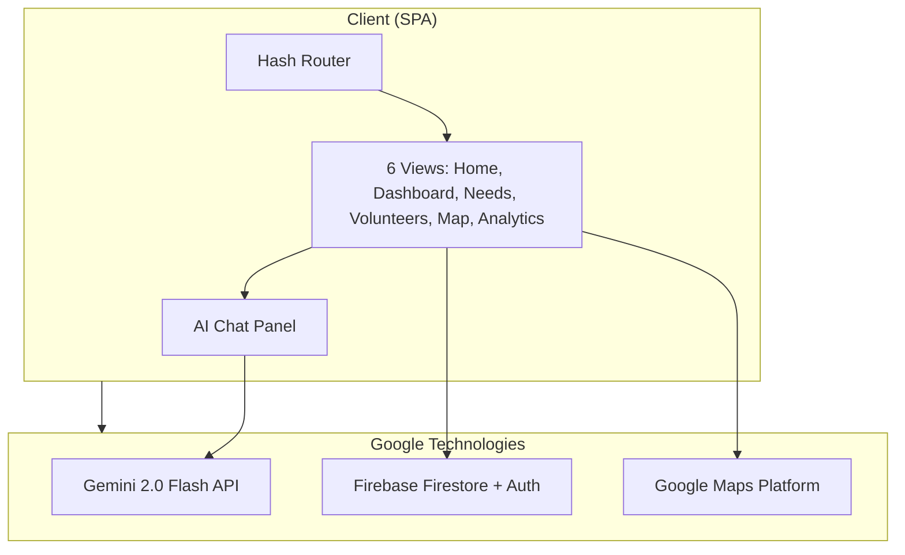

# 🌍 ImpactBridge — Smart Resource Allocation for Social Impact

> **Google Solution Challenge 2026 — Track: Smart Resource Allocation**  
> Data-Driven Volunteer Coordination for Social Impact

[](https://developers.google.com)
[](https://ai.google.dev)
[](https://firebase.google.com)

---

## 🎯 Problem Statement

> *"Local social groups and NGOs collect a lot of important information about community needs through paper surveys and field reports. However, this valuable data is often scattered across different places, making it hard to see the biggest problems clearly."*

**The Reality:**
- 🇮🇳 **3.4 million+ NGOs** operate in India
- 📋 **67% of collected data** from paper surveys goes unused
- ⏱️ **4+ hours** average time to manually coordinate volunteers
- ❌ **42% skill mismatch** between volunteers and assigned tasks
- 🔇 **78% of communities** don't know available help exists

## 💡 Our Solution

**ImpactBridge** is an AI-powered platform that transforms scattered NGO data into actionable insights, intelligently matching skilled volunteers to the communities that need them most — in real-time.

### How It Works

```
📄 Field Reports/Surveys → 🤖 Gemini AI Extraction → 📊 Prioritized Dashboard
                                                         ↓
👥 Volunteer Database → 🧠 AI Skill Matching → 🗺️ Geo-deployed Response
                                                         ↓
                                                  📈 Impact Analytics
```

---

## ✨ Key Features

### 1. 🤖 AI-Powered Need Analysis (Gemini 2.0 Flash)
- Upload paper surveys or field reports → AI extracts structured data
- Natural language input: *"50 families lost homes in Wayanad floods"*
- Automatic categorization, prioritization, and geocoding
- Dynamic urgency scoring based on severity, population, and time sensitivity

### 2. 🧑‍🤝‍🧑 Smart Volunteer Matching
- AI maps volunteer skills, availability, and location to community needs
- One-click coordination for rapid deployment
- Match scores (0–100%) based on skill relevance, experience, and proximity

### 3. 📊 Real-Time Dashboard
- Live overview of all community needs with trend charts
- Priority-sorted feed with category filtering
- Activity stream showing real-time platform events

### 4. 🗺️ Interactive Impact Map
- Canvas-rendered India map with need markers and volunteer locations
- Color-coded by priority (Critical/High/Medium/Low)
- Heatmap overlay showing need density
- Coverage stats and gap analysis

### 5. 📈 Impact Analytics
- Volunteer deployment trends (bar chart)
- Response time tracking with target lines
- Regional impact comparison (horizontal bars)
- Skill coverage radar chart (available vs. needed)
- AI-generated impact reports via Gemini

### 6. 💬 AI Assistant (Gemini)
- Chat interface for natural language queries
- *"Find 5 medical volunteers near Wayanad"*
- *"Generate an impact report for this quarter"*
- *"Parse this field report: [paste text]"*

---

## 🛠️ Tech Stack (Google Technologies)

| Layer | Technology | Purpose |
|---|---|---|
| **Frontend** | HTML5, CSS3, JavaScript (ES6+) | Premium SPA with glassmorphism UI |
| **AI/ML** | **Gemini 2.0 Flash API** | Need analysis, volunteer matching, report parsing |
| **Database** | **Firebase Firestore** | Real-time data synchronization |
| **Authentication** | **Firebase Auth** | Google Sign-in + anonymous mode |
| **Hosting** | **Firebase Hosting** | CDN-backed global deployment |
| **Maps** | **Google Maps Platform** | Geospatial visualization |
| **Charts** | Chart.js | Analytics visualization |

---

## 🚀 Quick Start

### Prerequisites
- A modern web browser (Chrome recommended)
- Node.js (optional, for local server)

### Run Locally

```bash
# Clone the repository
git clone https://github.com/aquasimp/ImpactBridge.git
cd impactbridge

# Option 1: Use any HTTP server
npx serve . -l 3000

# Option 2: Python
python -m http.server 3000

# Option 3: Open directly
# Just open index.html in your browser
```

Visit `http://localhost:3000` in your browser.

### Demo Mode
The app runs in **Demo Mode** by default with realistic sample data from across India. No API keys needed to explore all features.

### Enable Live Mode (Optional)

1. **Gemini AI:** Get an API key from [Google AI Studio](https://aistudio.google.com/apikey) and set it in `js/gemini.js`:
   ```js
   API_KEY: 'YOUR_GEMINI_API_KEY'
   ```

2. **Firebase:** Create a project at [Firebase Console](https://console.firebase.google.com) and update `js/firebase-config.js`:
   ```js
   LIVE_MODE: true,
   config: {
     apiKey: "...",
     authDomain: "...",
     projectId: "...",
     // etc.
   }
   ```

---

## 📂 Project Structure

```
impactbridge/
├── index.html                 # Main SPA shell (all views)
├── styles/
│   ├── main.css              # Design system + glassmorphism (1200+ lines)
│   └── animations.css        # Micro-animations library
├── js/
│   ├── app.js                # SPA router + main controller
│   ├── utils.js              # Utility functions + helpers
│   ├── firebase-config.js    # Firebase initialization
│   ├── auth.js               # Authentication module
│   ├── gemini.js             # Gemini AI integration
│   ├── needs.js              # Community need management (12 demo entries)
│   ├── volunteer.js          # Volunteer management (12 demo profiles)
│   ├── map.js                # Canvas-based India map visualization
│   ├── dashboard.js          # Dashboard stats + charts
│   └── analytics.js          # Impact analytics + AI reports
└── README.md                 # This file
```

---

## 🏗️ Architecture



---

## 📊 Impact Metrics (Demo Data)

| Metric | Value |
|---|---|
| Community needs tracked | 12 across 10 states |
| Registered volunteers | 12 with diverse skills |
| Critical needs active | 4 requiring immediate response |
| People affected | 39,850+ |
| States covered | 12 |
| Avg. response time | 2.8 hours (improving) |

---

## 🧪 Demo Data Highlights

### Sample Needs
- 🌊 **Flood Relief for 500 Families** — Silchar, Assam (Critical)
- 🏥 **Medical Camp for Tribal Villages** — Koraput, Odisha (Critical)
- 🏠 **Emergency Shelters in Delhi Winter** — Yamuna Pushta (Critical)
- 🍚 **Community Kitchen for Wayanad** — Kerala (Critical)
- 📚 **Education Supplies for Joshimath** — Uttarakhand (High)

### Sample Volunteers
- Dr. Priya Sharma — Medical, First Aid (Mumbai)
- Mohammed Irfan — Disaster Relief, Rescue Ops (Guwahati)
- Gurpreet Singh — Cooking, Food Distribution (Amritsar)
- Kavitha Nair — Environmental Science (Kochi)
- Vikram Reddy — Software Dev, Data Analysis (Hyderabad)

---

## 🎨 Design Philosophy

- **Glassmorphism UI** — Semi-transparent surfaces with backdrop blur
- **Dark Theme** — Slate/navy backgrounds for comfortable extended use
- **Emerald-Cyan Gradient** — Primary palette representing growth and impact
- **Material Symbols** — Google's icon system for consistency
- **Responsive** — Mobile-first CSS with breakpoints at 480/768/1200px
- **Micro-animations** — Scroll reveals, hover effects, toast notifications

---

## 📄 License

This project is built for the [Google Solution Challenge 2026](https://developers.google.com/community/gdsc-solution-challenge).

---

<div align="center">

**Built with ❤️ for communities that need it most**

🌍 ImpactBridge — *Bridging the gap between community needs and volunteer power*

</div>
